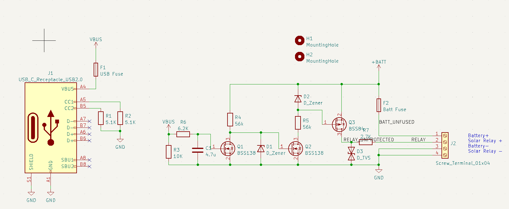
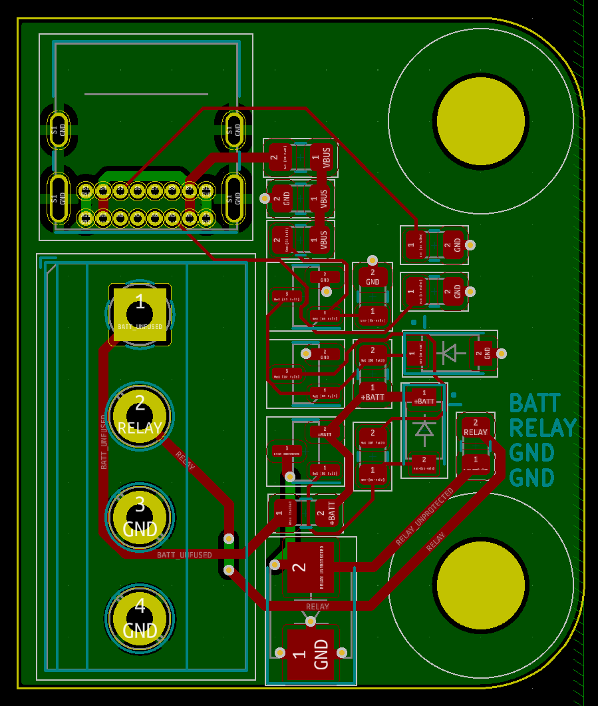
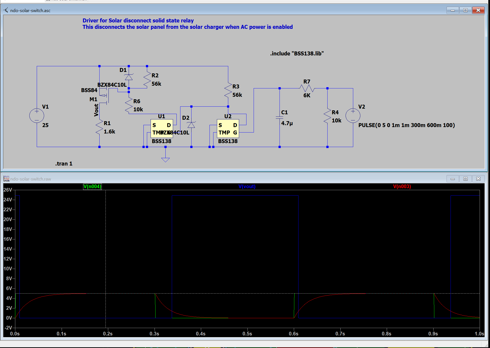

# Solar Power Interrupter PCB

## Purpose

We will be charging the camp battery from both solar and generators. However, we do not want to attempt to charge the battery from two source at once, since they are unable to cooperate.
To avoid this situation, the solar charger should automatically be disengaged when the generator is turned on.
The solar charger connection instructions says to connect the battery before the solar panels. Therefore to turn off the solar charger, we should disconnect the panels from the solar charger.

This connection is approximately a maximum of 100V and 12A, DC.

The generator is detected by the presence of 5V from a USB charger connected to the generator.

When the 5V is not present, the relay should be conducting. The current required to turn on the relay will be provided by the battery.

The solar power interrupter will effectively logically invert the input from the USB charger, and switch on/off the relay using the battery voltage and a high side switch.

## Parts:

- P-channel MOSFET: BSS84
- N-channel MOSFET: BSS138

## Features:

- Input RC filter in case the USB-C input flickers on and off while the generator starts or stops.
- Polyfuse on USB input
- Polyfuse on battery input

## Review Points:

- Check Vgs and Vds absolute maximums, must survive max battery voltage (25V)
  - Vgs out of range on both!:
    - Fix: add voltage dividers. [Done]
- Check that the pin numbering in the schematic, PCB, and data sheet are consistent.
- Check relay behavior - do I need a current limiting resistor on the input? should one be added anyway for safety?
- Verify USB-C connector CC connections.
- Verify PCB silk screen matches connections.
- Is the battery safe from all failures?
- Is the 5V USB supply safe from all failures?
- All parts have part numbers!

# Images

Note, some small changes have been made since these images were captured.

